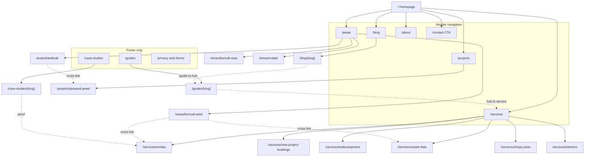

# 01. Site Architecture

Framework: `site-architecture` guide (hierarchy depth, three click rule, URL patterns, navigation limits, hub and spoke linking, anchor text discipline, orphan page audit). Locale rules from the `seo-audit` international section. Schema assignment previews `09-technical.md`.

---

## 1. Design principles applied here

| Principle | Source | How it lands on this site |
|---|---|---|
| Three click rule | `site-architecture` | Every page reachable from home in 2 clicks. The site is small enough that 3 levels is the ceiling |
| Go as flat as possible | `site-architecture` | Areas and services get one level of nesting each. Nothing goes to level 3 except blog and guide detail pages |
| 4 to 7 header nav items | `site-architecture` | 5 items plus one CTA |
| URL reflects hierarchy | `site-architecture` | `/areas/borivali-west` sits under `/areas`, and the breadcrumb mirrors it exactly |
| No orphan pages | `site-architecture` | Every URL in section 3 has at least one inbound internal link, listed in section 7 |
| Descriptive anchor text | `site-architecture` | No "click here" or "read more" anywhere. Full anchor map in section 7 |
| Hub and spoke | `site-architecture` and `content-strategy` | Five content clusters, each with a pillar guide as hub and blog posts as spokes |
| Cover the topical cluster, not the single keyword | `ai-seo` query fan out | Area pages link to the service pages and the cluster guides relevant to that suburb, so a fan out query lands somewhere on site regardless of phrasing |

---

## 2. Site type and depth

The `site-architecture` guide classifies this as **Small business** crossed with **Content site**. Small business alone would suggest 1 to 2 levels and roughly 10 pages. But the organic moat objective requires a real content operation, which pushes it toward the hybrid pattern at 3 levels.

**Chosen depth: 3 levels maximum.**

- L0: homepage
- L1: primary sections (services, areas, projects, blog, guides, about, contact)
- L2: detail pages (individual services, suburbs, projects, posts, guides)

Nothing goes deeper. In particular, service by area combination pages that would sit at L3 (`/areas/borivali-west/rentals`) are **excluded at launch**. Reasoning in `00-executive-summary.md` section 4: most of those terms show under 50 searches a month and 24 near duplicate pages is a thin content liability. Revisit in month 2 with SERP data.

---

## 3. Full page inventory

Locale note: English is unprefixed because `localePrefix` is `as-needed`. Hindi, Marathi and Gujarati variants exist at `/hi/...`, `/mr/...`, `/gu/...` **only where genuinely translated body content exists in Sanity**. See section 8.

Status key: **E** exists today, **F** exists but needs fixing, **N** new build.

### Level 0

| Page | URL | Status | Nav | Priority | Primary schema |
|---|---|---|---|---|---|
| Homepage | `/` | F | Logo, header | Highest | RealEstateAgent + WebSite + FAQPage |

Fixes needed: remove the unsourced 4.8★ stat, correct "25+ years" to "Since 1996", add canonical, add hreflang, add JSON-LD. Detail in `02-page-specs.md`.

### Level 1: primary sections

| Page | URL | Status | Nav | Priority | Primary schema |
|---|---|---|---|---|---|
| Services index | `/services` | E | Header | High | Service + ItemList + BreadcrumbList |
| Areas index | `/areas` | **N** | Header | High | ItemList + BreadcrumbList |
| Projects index | `/projects` | E | Header | Medium | ItemList + BreadcrumbList |
| Blog index | `/blog` | E | Header | Medium | Blog + BreadcrumbList |
| Guides index | `/guides` | **N** | Footer | Medium | CollectionPage + ItemList |
| About | `/about` | **N** | Header | High | AboutPage + RealEstateAgent + Person |
| Contact | `/contact` | **N** | Header CTA | High | ContactPage + LocalBusiness |
| Case studies index | `/case-studies` | **N** | Footer | Medium | CollectionPage + ItemList |
| Privacy policy | `/privacy` | **N** | Footer | Low | WebPage |
| Terms | `/terms` | **N** | Footer | Low | WebPage |

`/about` is called out as high priority despite being a conventional page. In a YMYL adjacent category it carries your entire E-E-A-T load: named humans, 1996 provenance, MahaRERA registration, physical address. The `ai-seo` guide identifies expert attribution as a 25 to 30% citation boost, and right now the site has none. The `teamMember` Sanity schema was already built for this page and never used.

### Level 2: service detail

All six exist with DataForSEO validated copy. They need the FAQ layer, schema and breadcrumbs added, not rewriting.

| Page | URL | Status | Priority | Primary schema |
|---|---|---|---|---|
| Resale flats | `/services/resale-flats` | E | High | Service + FAQPage + BreadcrumbList |
| Rentals | `/services/rentals` | E | **Highest** | Service + FAQPage + BreadcrumbList |
| New project bookings | `/services/new-project-bookings` | E | High | Service + FAQPage + BreadcrumbList |
| Redevelopment | `/services/redevelopment` | E | Medium | Service + FAQPage + BreadcrumbList |
| Shops and plots | `/services/shops-plots` | E | Medium | Service + FAQPage + BreadcrumbList |
| Interiors and civil work | `/services/interiors` | E | High | Service + FAQPage + BreadcrumbList |

Rentals is the highest priority page on the site by search volume. The existing research found rental flat Mumbai at 12,100 a month, flat for rent in Borivali at 590 a month, flat for rent Borivali West at 390 a month. Nothing else on the site comes close. Interiors is next on volume (interior designer Borivali at 480 a month) and is also your highest margin service.

### Level 2: area landing pages

All new. This is the single highest leverage build in the plan.

| Page | URL | Status | Priority | Anchor query and volume | Primary schema |
|---|---|---|---|---|---|
| Borivali West | `/areas/borivali-west` | **N** | **Highest** | property in borivali west, 140 a month | RealEstateAgent + Place + FAQPage + BreadcrumbList |
| Borivali East | `/areas/borivali-east` | **N** | High | property in borivali east, 90 a month, high competition | RealEstateAgent + Place + FAQPage + BreadcrumbList |
| Kandivali | `/areas/kandivali` | **N** | **Highest** | real estate kandivali, 210 a month, low competition | RealEstateAgent + Place + FAQPage + BreadcrumbList |
| Malad | `/areas/malad` | **N** | High | flats in malad, 260 a month | RealEstateAgent + Place + FAQPage + BreadcrumbList |

Four pages, not six. Borivali splits West and East because DataForSEO showed genuinely differentiated volume for both. Kandivali and Malad do not split, because the measured demand sits at suburb level, not at West and East level. Building `/areas/kandivali-west` and `/areas/kandivali-east` would be splitting 210 searches across two thinner pages.

Kandivali is flagged highest priority alongside Borivali West despite lower volume because the research recorded it as **low competition**, and because Jaswanti Jewel is in Kandivali West. That page gets to be both an area page and the natural referrer to your flagship project.

### Level 2: project detail

| Page | URL | Status | Priority | Primary schema |
|---|---|---|---|---|
| Jaswanti Jewel | `/projects/jaswanti-jewel` | E | High | Residence + Product offer + FAQPage + BreadcrumbList |

Pricing stays masked or gated. `Product` schema with an `offers` block is only added **if** you confirm real, current, unmasked prices. Marking up masked prices would be inaccurate structured data, which the `schema` guide's accuracy first principle rules out and which risks a manual action. Default assumption: no `offers` block, use `Residence` only.

### Level 2: content detail

| Page | URL pattern | Status | Count at launch | Primary schema |
|---|---|---|---|---|
| Blog post | `/blog/[slug]` | E | 10 | BlogPosting + BreadcrumbList |
| Pillar guide | `/guides/[slug]` | **N** | 1 of 5 | Article + FAQPage + BreadcrumbList |
| Case study | `/case-studies/[slug]` | **N** | 0 at launch, 2 to 3 by week 4 | Article + Review + BreadcrumbList |

**Why guides get their own route rather than living under `/blog`.** The `content-strategy` guide says most content works fine under `/blog` and dedicated hub URLs are only warranted for major topics with layered depth. Five clusters of 10 to 12 posts each is exactly that case. The pillars are 4,000+ word evergreen resources that anchor the internal link graph and act as the primary AI citation targets. Separating them signals to both readers and crawlers that these are reference documents, not dated posts. Implementation is cheap: `/guides/[slug]` copies the existing `/services/[slug]` route pattern against the same Sanity `page` schema.

### Paid landing pages

Excluded from the sitemap. `noindex, follow`. These exist to serve ad traffic and to be measured, not to rank. Keeping them out of the index also avoids them competing with the service and area pages for the same terms.

| Page | URL | Campaign | Status |
|---|---|---|---|
| Rentals landing | `/lp/rent-borivali` | Google Search, rentals | **N** |
| Resale buyer landing | `/lp/buy-borivali` | Google Search, resale and buying | **N** |
| Jaswanti Jewel landing | `/lp/jaswanti-jewel` | Google Search, project bookings | **N** |

Mapping and Quality Score requirements in `08-paid-campaigns.md`.

### Machine readable files

| File | Purpose | Source |
|---|---|---|
| `/robots.txt` | Crawl rules, explicit allow for GPTBot, ChatGPT-User, PerplexityBot, ClaudeBot, Google-Extended, Bingbot. Sitemap reference | `ai-seo` AI bot access |
| `/sitemap.xml` | All indexable URLs with hreflang alternates | `seo-audit` international sitemaps |
| `/llms.txt` | Plain language description of the business, service area, and links to key pages | `ai-seo` machine readable files |

There is no `/pricing.md`. The `ai-seo` guide recommends one, but it assumes published prices. Yours are deliberately masked and gating them is a considered commercial decision, not an oversight. Publishing a machine readable price file would contradict that. Noted as a deliberate deviation.

**Total indexable pages at launch: 24.** Plus 3 noindexed landing pages.

---

## 4. Hierarchy tree

```
Homepage (/)
├── Services (/services)
│   ├── Rentals (/services/rentals)                          [highest volume]
│   ├── Resale flats (/services/resale-flats)
│   ├── New project bookings (/services/new-project-bookings)
│   ├── Redevelopment (/services/redevelopment)
│   ├── Shops and plots (/services/shops-plots)
│   └── Interiors and civil work (/services/interiors)
├── Areas (/areas)
│   ├── Borivali West (/areas/borivali-west)
│   ├── Borivali East (/areas/borivali-east)
│   ├── Kandivali (/areas/kandivali)
│   └── Malad (/areas/malad)
├── Projects (/projects)
│   └── Jaswanti Jewel (/projects/jaswanti-jewel)
├── Blog (/blog)
│   └── Post (/blog/[slug])                                  [10 at launch]
├── Guides (/guides)
│   └── Pillar guide (/guides/[slug])                        [1 at launch, 5 planned]
├── Case studies (/case-studies)
│   └── Case study (/case-studies/[slug])                    [0 at launch]
├── About (/about)
├── Contact (/contact)
├── Privacy (/privacy)
└── Terms (/terms)

Not in navigation, not in sitemap, noindex:
    /lp/rent-borivali
    /lp/buy-borivali
    /lp/jaswanti-jewel
```

---

## 5. Visual sitemap



---

## 6. Navigation specification

### Header

Five items plus one CTA, inside the `site-architecture` limit of 4 to 7.

| Position | Label | Target | Notes |
|---|---|---|---|
| Logo, left | Shree Giriraj Real Estate | `/` | |
| 1 | Services | `/services` | Dropdown listing all six, ordered by priority: Rentals, Resale flats, New project bookings, Interiors, Redevelopment, Shops and plots |
| 2 | Areas | `/areas` | Dropdown: Borivali West, Borivali East, Kandivali, Malad |
| 3 | Projects | `/projects` | No dropdown while there is one project |
| 4 | Blog | `/blog` | |
| 5 | About | `/about` | |
| CTA, right | Talk to us on WhatsApp | `wa.me` deep link | Green. Fires `whatsapp_click` with `location: header` |

Language toggle stays where it is. Dropdown parents remain clickable links to the index page, not label only triggers, so the index pages accumulate link equity rather than being orphaned behind a hover.

Ordering rationale: Services first because it carries the commercial intent. Areas second because it is the organic engine. Both ahead of Projects, which currently holds one item.

### Mobile

The existing sticky bottom Call and WhatsApp bar stays. Header collapses to a hamburger. The floating WhatsApp button stays hidden on mobile so the two do not duplicate, which the current build already handles correctly.

### Footer

Four columns, following the `site-architecture` grouping pattern.

| Services | Areas | Company | Get in touch |
|---|---|---|---|
| Rentals in the western suburbs | Property in Borivali West | About Shree Giriraj | Both phone numbers, click to call |
| Resale flats | Property in Borivali East | Client stories | Email address |
| New project bookings | Property in Kandivali | Guides and resources | Full postal address, NAP exact |
| Redevelopment advisory | Flats in Malad | Blog | WhatsApp link |
| Shops and plots | | Privacy policy | Google Business Profile link |
| Interiors and civil work | | Terms | |

Footer bar: `© Shree Giriraj Real Estate. MahaRERA Reg. No. A51800005726.` The RERA number must appear site wide.

The footer is where `/guides` and `/case-studies` get their site wide inbound link, which is what keeps them out of orphan status without cluttering the header.

### Breadcrumbs

Not currently implemented. Add to every page below L1. Mirrors the URL path exactly, per the `site-architecture` breadcrumb and URL alignment rule. Every segment is a link except the current page. Carries `BreadcrumbList` JSON-LD.

```
Home > Services > Rentals
Home > Areas > Borivali West
Home > Projects > Jaswanti Jewel
Home > Blog > Post title
Home > Guides > Guide title
```

Breadcrumbs are free internal links on every page and they are the cheapest fix in this plan.

---

## 7. Internal linking map

Rules applied, from `site-architecture`:
- Every page has at least one inbound internal link. Orphan audit in section 7.5
- Anchor text is descriptive and varied. No "click here", no "read more", no bare URLs
- Roughly 5 to 10 contextual internal links per 1,000 words of content
- The most important pages get the most inbound links

### 7.1 Homepage outbound

| To | Anchor text | Placement | Type |
|---|---|---|---|
| `/services/rentals` | Renting a flat in Borivali or Kandivali | Services grid card | Navigational |
| `/services/resale-flats` | Buying or selling a resale flat | Services grid card | Navigational |
| `/services/new-project-bookings` | Booking a new launch | Services grid card | Navigational |
| `/services/redevelopment` | Society redevelopment advice | Services grid card | Navigational |
| `/services/shops-plots` | Shops, offices and plots | Services grid card | Navigational |
| `/services/interiors` | Interiors and civil work | Services grid card | Navigational |
| `/areas/borivali-west` | Property in Borivali West | Areas section card | Navigational |
| `/areas/borivali-east` | Property in Borivali East | Areas section card | Navigational |
| `/areas/kandivali` | Property in Kandivali | Areas section card | Navigational |
| `/areas/malad` | Flats in Malad | Areas section card | Navigational |
| `/projects/jaswanti-jewel` | Jaswanti Jewel, Kandivali West | Featured project block | Contextual |
| `/about` | the family that has run this office since 1996 | Trust section body copy | Contextual |
| `/contact` | Visit our office in Chikoowadi | Contact section | Navigational |
| `/blog` | Guides for buyers, tenants and societies | Blog teaser strip | Navigational |

### 7.2 Area page outbound, the pattern for all four

Using Borivali West as the model. The other three follow identically with their own suburb name.

| To | Anchor text | Placement | Type |
|---|---|---|---|
| `/services/rentals` | rent a flat in Borivali West | Services in this area block | Cross section |
| `/services/resale-flats` | buy a resale flat in Borivali West | Services in this area block | Cross section |
| `/services/interiors` | interior and civil work once you have the keys | Services in this area block | Cross section |
| `/services/redevelopment` | redevelopment advice for Borivali societies | Services in this area block | Cross section |
| `/areas/borivali-east` | how Borivali East compares | Nearby areas block | Lateral |
| `/areas/kandivali` | Kandivali, one station north | Nearby areas block | Lateral |
| `/guides/[buying-cluster]` | our full guide to buying in the western suburbs | Body copy | Spoke to hub |
| `/blog/[relevant-post]` | Two to three contextual links to posts about this suburb | Body copy | Contextual |
| `/contact` | talk to us about Borivali West | Section CTA | Conversion |

Lateral links between area pages matter more than they look. They catch the comparison intent ("Borivali or Kandivali") that the `ai-seo` guide describes as query fan out, and they distribute equity across all four suburb pages rather than concentrating it on one.

### 7.3 Service page outbound, the pattern for all six

Using Rentals as the model.

| To | Anchor text | Placement | Type |
|---|---|---|---|
| `/areas/borivali-west` | rentals in Borivali West | Where we do this block | Cross section |
| `/areas/borivali-east` | rentals in Borivali East | Where we do this block | Cross section |
| `/areas/kandivali` | rentals in Kandivali | Where we do this block | Cross section |
| `/areas/malad` | rentals in Malad | Where we do this block | Cross section |
| `/services/interiors` | getting the flat move in ready | Related services | Lateral |
| `/services/resale-flats` | if you would rather buy than rent | Related services | Lateral |
| `/guides/renting-in-the-western-suburbs` | the full renting guide | Body copy | Spoke to hub |
| `/case-studies/[slug]` | how we handled a similar let | Proof block, once case studies exist | Proof |
| `/contact` | tell us what you are looking for | Section CTA | Conversion |

### 7.4 Content cluster linking

Five clusters. Each pillar guide is the hub. Every spoke post links back to its hub with a descriptive anchor, the hub links out to every spoke, and spokes link laterally where genuinely relevant.

| Cluster | Pillar hub | Spokes at launch | Links to service | Links to areas |
|---|---|---|---|---|
| Buying in the western suburbs | `/guides/buying-a-flat-in-borivali` **built at launch** | 3 | `/services/resale-flats`, `/services/new-project-bookings` | all four |
| Renting | `/guides/renting-in-the-western-suburbs` outlined only | 3 | `/services/rentals` | all four |
| Society redevelopment | `/guides/society-redevelopment-mumbai` outlined only | 2 | `/services/redevelopment` | Borivali West and East |
| Paperwork, stamp duty and home loans | `/guides/property-paperwork-mumbai` outlined only | 2 | all six | none directly |
| Interiors and moving in | `/guides/home-interiors-mumbai` outlined only | 0 | `/services/interiors` | none directly |

Only one pillar is written at launch. Buying is chosen because it feeds the two highest commercial intent services and because new projects in Borivali carried a CPC of $2.19 in the existing research, which is the clearest commercial signal in the dataset.

The paperwork cluster is flagged as the highest AEO value even though it has no pillar at launch. The existing SERP research surfaced People Also Ask questions on stamp duty and valuation, which are exactly the extractable, answer first questions the `ai-seo` guide says get cited. Full treatment in `05-aeo-faq.md`.

### 7.5 Orphan audit

Every URL in section 3 checked for at least one inbound internal link.

| Page | Inbound links | Orphan risk |
|---|---|---|
| All six service pages | Header dropdown, footer, homepage grid, all four area pages | None |
| All four area pages | Header dropdown, footer, homepage grid, lateral from other area pages, service pages | None |
| `/projects/jaswanti-jewel` | Homepage featured block, `/projects`, `/areas/kandivali` | None |
| `/about` | Header, footer, homepage trust section | None |
| `/contact` | Header CTA, footer, every page CTA | None |
| `/guides` | Footer only | **Low risk.** Also linked from every pillar guide breadcrumb |
| `/guides/[slug]` | `/guides` index, every spoke post, relevant service and area pages | None |
| `/case-studies` | Footer only | **Low risk.** Mitigated once case studies are linked from service pages |
| `/case-studies/[slug]` | Index, plus the relevant service page proof block | None until content exists |
| `/blog/[slug]` | `/blog` index, its pillar hub, related posts | None |
| `/privacy`, `/terms` | Footer | None. Low priority by design |
| `/lp/*` | **Zero by design.** Ad traffic only, noindex | Intentional |

Two low risk items, both footer only. Both are acceptable because `/guides` and `/case-studies` are index pages whose children carry the real value and are themselves well linked. If either underperforms, the fix is a link from the homepage blog teaser strip.

---

## 8. Locale architecture

This is the most consequential technical decision in the plan and it must land on Day 1, before any English content is published.

### The problem

`getLocalizedField` in `src/lib/i18n-content.ts` silently falls back to English when a locale is missing. You have chosen English only for new content. So the moment a blog post is published, it renders **identical English body text at four URLs** with only nav and footer translated.

The `seo-audit` guide names this failure mode directly: "only boilerplate translated, main content identical across locales" and "thin locale pages dragging down site wide quality signal". Because Google's helpful content system operates site wide, thin Hindi, Marathi and Gujarati pages can suppress rankings for the strong English pages too. There is currently no hreflang and no canonical to mitigate it, so Google has no signal at all.

Every English only page published makes it worse. This is why it is a Day 1 item.

### The decision

**Keep the four locale interface. Gate content routes on real translated content.**

| Page group | Locales generated | Reasoning |
|---|---|---|
| Homepage | en, hi, mr, gu | Already fully translated in all four. Genuine content |
| Six service pages | en, hi, mr, gu | Already fully translated in all four per the service pages plan, which required every locale populated with no English fallback |
| Nav, footer, forms, UI chrome | en, hi, mr, gu | Fully translated in `messages/*.json` |
| **Four area pages** | **en only at launch** | New. English only. Hindi and Marathi are strong candidates for translation in month 2, since these target genuinely local intent |
| **Blog posts and guides** | **en only** | New. English only, indefinitely |
| **Case studies** | **en only** | New |
| `/about`, `/contact`, legal | en, hi, mr, gu | Short pages, cheap to translate properly, and `/about` carries E-E-A-T in every locale |

### The implementation change

`generateStaticParams` for content routes must only emit locales where a real localized body exists in Sanity. Where it does not, the route returns `notFound()` rather than rendering an English fallback. A 404 is a clean signal. A duplicate is a penalty.

`getLocalizedField` keeps its fallback behaviour for **UI strings and short metadata**, where falling back to English is correct and harmless. The gate applies to **body content** only. This distinction matters and should be enforced by a helper with a different name, not by changing the existing function.

### Hreflang and canonical rules

Per the `seo-audit` international section:

- Every page self canonicalises. `/mr/services/rentals` canonicalises to itself, never across to the English version. Cross locale canonical suppresses the non canonical locale entirely
- Every page carries a full reciprocal hreflang set including **a self referencing entry**. A missing self reference causes Google to ignore the entire hreflang cluster
- `x-default` points to the English homepage
- Language codes are `en`, `hi`, `mr`, `gu`. No region suffixes, because the audience is one country
- Hreflang is emitted **only for locales that actually exist for that URL**. An English only blog post carries no hreflang at all, which is correct, rather than pointing at four URLs where three do not exist
- **Next.js caveat, flagged in the guide:** `alternates.languages` does not automatically include a self referencing entry for the `<loc>` URL. It must be added explicitly. This is a known silent failure and is easy to miss in review

---

## 9. URL conventions

| Rule | Decision |
|---|---|
| Case | Lowercase always. Uppercase variants 301 to lowercase |
| Word separator | Hyphens in slugs. These are technical identifiers, not prose |
| Trailing slash | No trailing slash. Enforced with a 301 |
| Dates in blog URLs | None. `/blog/stamp-duty-in-mumbai`, never `/blog/2026/08/stamp-duty` |
| IDs in URLs | None. Slugs only |
| Locale prefix | `as-needed`. English at root, others prefixed. Already configured |
| Depth ceiling | 3 segments. `/areas/borivali-west` is 2. `/blog/[slug]` is 2 |
| Protocol and host | `https://www.` canonical. The apex 301s to `www`. Must be consistent across canonical, hreflang and sitemap or hreflang clusters are discarded |

### Redirects to configure at launch

There is no legacy site, so there are no historic URLs to preserve. Only the hygiene set:

| From | To | Type |
|---|---|---|
| `http://*` | `https://*` | 301 |
| apex domain | `www` subdomain | 301 |
| Any URL with a trailing slash | Without | 301 |
| Any uppercase path | Lowercase | 301 |
| `/en/*` | `/*` | 301, since `as-needed` means English is unprefixed and `/en/` must not become a duplicate set |

That last one is easy to overlook and would otherwise create a full duplicate of the English site.

---

## 10. What this architecture does not include, and why

| Excluded | Reason |
|---|---|
| Service by area combination pages, 24 of them | Most target terms are under 50 searches a month. Thin content risk exceeds the opportunity. Revisit in month 2 for the 2 or 3 combinations with real volume, such as rentals in Borivali at 590 a month |
| A property listings database | You are not a portal and cannot win that fight. Your inventory changes faster than you can maintain pages for it, and stale listings damage trust. WhatsApp is a better inventory channel than a website |
| Filterable search or map interface | Heavy to build, heavy on Core Web Vitals, and it competes with portals on their strength rather than yours |
| A pricing page or `/pricing.md` | Prices are deliberately masked. Publishing a machine readable price file would contradict a considered commercial decision |
| Comparison or versus pages | The `competitors` guide framework applies to products, not to local agents. Naming rival Borivali brokers on your own site is a reputational risk with no clear search demand behind it. Revisit only if SERP data shows the queries exist |
| Author archive pages | Only meaningful with multiple authors and volume. Backlog |
| Blog tag pages | Categories only. Tag pages are a classic thin content and crawl budget trap on small sites |

---

## 11. Open items carried to `11-open-questions.md`

1. Is `shreegiriraj.in` available. Not checked. The codebase assumes `www.shreegiriraj.in`
2. Should the four area pages be translated into Marathi and Hindi in month 2. I have no volume data for those locales and will not guess
3. Does a Google Business Profile already exist for this address, and is it claimed, duplicated, or unclaimed. This changes the `/contact` and area page NAP approach
4. **Resolved 25 August 2026:** `A51800005726` is the agent registration and belongs site wide in the footer, as it is used here. Jaswanti Jewel still needs its own **project** registration number displayed on any page that promotes it
5. Who ranks for the four area queries today. Not researched. Recommend a DataForSEO SERP pull on Day 2 before finalising area page depth
